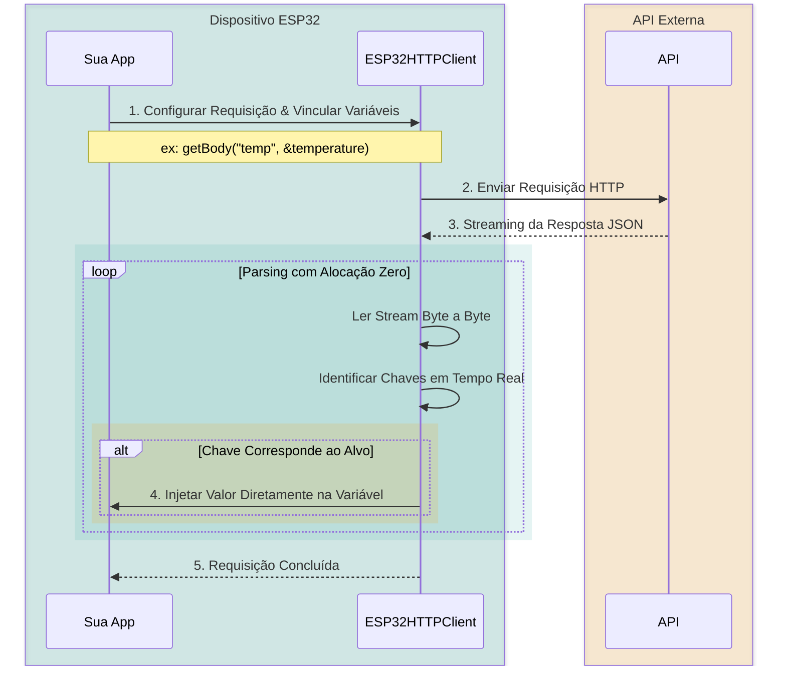

# Biblioteca ESP32 HTTP Client

> Um cliente HTTP fluente e orientado a objetos para ESP32 que **vincula os campos da resposta JSON diretamente às suas variáveis** — sem `ArduinoJson`, sem strings intermediárias, sem código clichê.

[](https://github.com/PedroFnseca/esp32-http-client)
[](https://github.com/PedroFnseca/esp32-http-client)
[](https://github.com/PedroFnseca/esp32-http-client)
[](https://github.com/PedroFnseca/esp32-http-client)
[](https://github.com/PedroFnseca/esp32-http-client/blob/main/LICENSE)
[](https://github.com/PedroFnseca/esp32-http-client/stargazers)

---

## O que é?

**ESP32-HTTP-Client** é uma biblioteca leve do Arduino para o ESP32 que repensa como você interage com APIs REST. Em vez de obter uma string JSON bruta e depois analisá-la, você simplesmente diz ao cliente *onde* colocar os dados, e ele cuida do resto.

```cpp
int userId;
float temperature;
char city[32];

client.get("/report")
      .getBody("userId", &userId)
      .getBody("sensor.temp", &temperature)
      .getBody("0.address.city", city, sizeof(city));
```

Uma única cadeia fluente. Vinculação direta de memória. Zero alocações na heap para a resposta.

### Como Funciona



---

## Desempenho em Destaque

Comparativo medido em **100 requisições HTTP GET consecutivas** com cargas JSON em um dispositivo ESP32 real:

| Métrica | Padrão (HTTPClient + ArduinoJson) | ESP32-HTTP-Client |
| :--- | :---: | :---: |
| **Alocação de heap por requisição** | ~58.2 KB | **~15 bytes** |
| **Pegada média de RAM** | 34.2% | **24.3%** |
| **Heap livre mínima** | 114.3 KB | **128.6 KB** |
| **Tempo médio de execução** | ~750 ms | **~59 ms** |

→ [Veja a análise de desempenho completa](performance.pt.md)

---

## Instalação Rápida

=== "Gerenciador de Bibliotecas do Arduino"

    Procure por **ESP32-HTTP-Client** no Gerenciador de Bibliotecas do Arduino IDE e clique em **Instalar**.

=== "PlatformIO"

    Adicione `ESP32-HTTP-Client` ao seu `platformio.ini`:
    ```ini
    lib_deps =
        PedroFnseca/ESP32-HTTP-Client@^1.4.0
    ```

=== "Manual"

    Baixe a [última versão](https://github.com/PedroFnseca/esp32-http-client/releases) e coloque a pasta dentro do seu diretório `Arduino/libraries/`.

→ [Guia de instalação completo](getting-started/installation.pt.md)

---

## Início Rápido em 30 Segundos

```cpp
#include <WiFi.h>
#include "ESP32HTTPClient.h"

ESP32HTTPClient client("https://jsonplaceholder.typicode.com");

void setup() {
    Serial.begin(115200);
    WiFi.begin("SEU_SSID", "SUA_SENHA");
    while (WiFi.status() != WL_CONNECTED) delay(100);

    int userId = 0;

    // A API retorna: { "userId": 1, "id": 1, "title": "...", "completed": false }
    client.get("/todos/1").getBody("userId", &userId);

    Serial.printf("ID do Usuário: %d\n", userId);
}

void loop() {}
```

→ [Ver todos os exemplos](examples/index.pt.md)

---

<p align="center">
  Se esta biblioteca economizou seu tempo, considere deixar uma ⭐ no <a href="https://github.com/PedroFnseca/esp32-http-client">GitHub</a>.
</p>
